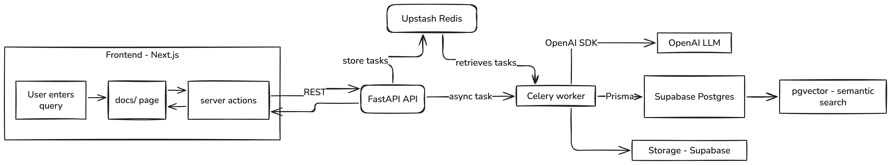
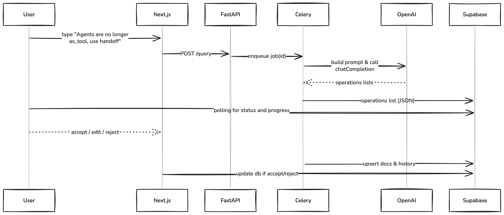
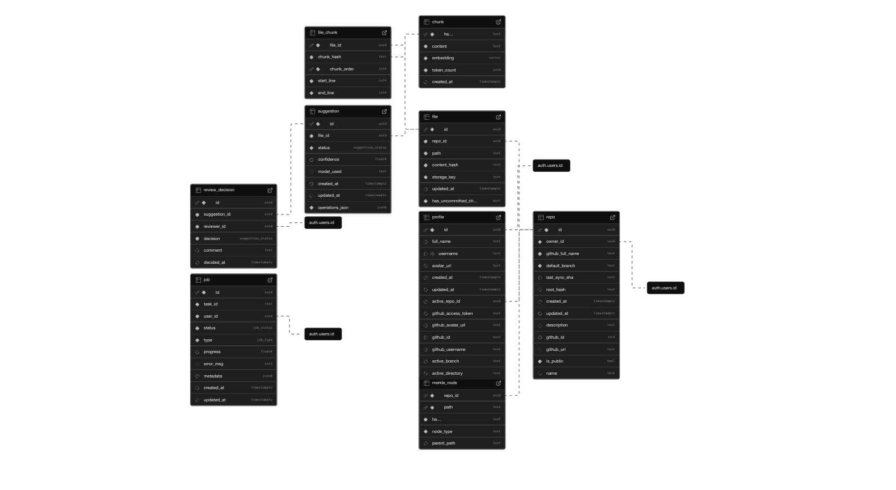

<div align="center">
  
  <h1>Doccelerate – AI Powered Documentation Editor</h1>
</div>

Hello!  This is a side-project I put together for the **Pluno Engineering Challenge**.  It lets you describe a documentation change in plain English and then shows AI-generated edit suggestions that you can tweak or approve.

🟢 **Give it a spin:** https://doccelerate-web-production.up.railway.app/

---

## 📜 Challenge Recap

Here’s how I understood the brief:

Pluno asked me to build an app that:

1. Lets a user describe a documentation change in plain English.
2. Uses AI to propose edits across a Markdown knowledge base (OpenAI Agents SDK docs in this case).
3. Shows the diff so the user can **accept / reject / tweak** every suggestion.
4. Persists the approved updates.

I had about a week, so I focused on getting the happy-path working end-to-end rather than polishing every edge case.

---

## ✨ What it can do

• Turn a short written request into suggested Markdown edits.  
• Let you review those changes in a side-by-side diff (powered by Monaco) and adjust anything by hand.  
• Show live indexing progress and stream back partial AI answers so you’re not waiting in the dark.  
• Connect to GitHub so you can work with _your_ docs and commit updates straight from the UI.  
• Rely on Supabase for auth/storage and pgvector search under the hood.  
• Run heavier LLM calls in the background so the UI stays responsive.  
• Share one Prisma schema between the Python (FastAPI) and TypeScript (Next.js) code.  

---

## 🏗️ Architecture (high-level glance)



### Query Flow Sequence


---

## 🗄️ Supabase ERD (Excerpt) 



_The same schema exists in `api/prisma/` (Python) & `web/prisma/` (TypeScript) and is kept in sync via **`make db-sync`**._

---

## 🔗 GitHub Integration
The challenge came with a ZIP of scraped Markdown.  In real life most docs live in Git, so I decided to hook straight into GitHub instead.

**Why?**

1. Repos already contain the single source-of-truth for docs, code and history.  
2. Pull-request workflows are familiar to every developer.  
3. Opens the door for users to bring **any public repo** – not just the OpenAI Agents SDK.

**How it works**

1. From the **Repos** page you add a public repository (e.g. [`openai/openai-agents-python`](https://github.com/openai/openai-agents-python)).  
2. The backend clones it, extracts Markdown / docs folder and indexes chunks to pgvector.  
3. When you accept an edit, you have an option to push your changes to the repository. If you choose to do so, Doccelerate commits the change to Github.

> ✨ _This makes Doccelerate immediately useful for **any** open-source or internal project — no manual file uploads required._

---

## 🚀 Getting Started (run it locally)

### 1. Prerequisites

(If you just want to click around, head to the hosted link at the top — no setup needed.)

• Python 3.11+ (`uv` package manager)  
• Node 18+  
• Supabase project (free tier is fine)  
• OpenAI API key  

### 2. Clone & Configure

```bash
$ git clone https://github.com/yourname/doccelerate.git && cd doccelerate
$ cp .env.sample .env               # fill in secrets
$ make db-sync                      # pull Supabase schema & generate Prisma clients
```

### 3. Development

```bash
# start backend + frontend + worker + db proxies
$ make up          # docker-compose up --build

# or run pieces individually
$ make api         # FastAPI on http://localhost:8000
$ make web         # Next.js on http://localhost:3000
$ make worker      # Celery worker processing LLM jobs
```

### 4. Testing a Flow

1. Go to `http://localhost:3000/docs`  
2. Wait for the **Indexing** banner to complete (streamed via Supabase realtime).  
3. Enter a change request, e.g. _"Remove references to `agents.as_tool`"_.  
4. Review the AI diff, tweak if needed, **Save**.  
5. Check GitHub branch `doccelerate/updates-<timestamp>` for commit.

---

## 📦 Environment Variables (excerpt)

```env
# === Global ===
OPENAI_API_KEY="sk-..."
SUPABASE_URL="https://xyz.supabase.co"
SUPABASE_ANON_KEY="public-..."
REDIS_URL="
  rediss://xyz.upstash.io:6379"

# === API ===
API_PREFIX="/api/v1"
ALLOWED_ORIGINS=["http://localhost:3000"]

# === Web ===
NEXT_PUBLIC_SUPABASE_URL="${SUPABASE_URL}"
NEXT_PUBLIC_SUPABASE_ANON_KEY="${SUPABASE_ANON_KEY}"
NEXT_PUBLIC_APP_NAME="Doccelerate"
```

---

## ⚖️ Trade-Offs & Shortcuts

Since this was a time-boxed prototype I consciously took a few shortcuts.  I’ve listed the biggest ones below together with what I’d tackle in a production setting.

| # | Decision | Rationale (Speed) | Proper Production Alternative |
|---|-----------|------------------|------------------------------|
| 1 | **Operations-list editing instead of unified-patch** | Simplified JSON diff was less error-prone than text-patch application. | Adopt *git apply* style patches or LLM-guided structured edits with conflict resolution. |
| 2 | **Upstash Redis** | No local install, instant cloud queue. | Managed Redis (AWS ElastiCache) inside VPC with IAM auth. |
| 3 | **Green-field FastAPI + Next.js instead of template** | Faster for me to scaffold from scratch & know every line. | Use an opinionated template or spend time creating our own standards, consistent CI/CD pipelines. |
| 4 | **Minimal folder organisation** | Ship quickly. | Feature-oriented modular monorepo, strict domain boundaries. |
| 5 | **Supabase for Auth + Storage + DB** | One-stop backend frees time. | Dedicated auth service, S3, managed Postgres. |
| 6 | **OpenAI SDK only** | Avoid extra abstraction. | LangChain / CrewAI for tool-oriented agents, better eval harness. |
| 7 | **No unit / e2e tests** | Time-boxed. | Pytest + Playwright coverage, CI gates. |
| 8 | **Secrets in .env** | Local dev simplicity. | Use HashiCorp Vault / AWS Secrets Manager, GitHub OIDC. |
| 9 | **Single queue for all jobs** | Simpler infra. | Separate high/low-priority queues, autoscaling workers. |
| 10 | **Minimal upfront research on existing solutions** | Jumped straight into building to meet the deadline. | Spend more time studying similar products & academic work before choosing architecture / algorithms. |

---

## 🧠 Two-Pass AI Documentation Generation

I've implemented a more intelligent approach to documentation updates using a two-pass system:

### How it works:
1. **Pass 1: File Selection**
   - AI analyzes the user's request and available documentation
   - Identifies which specific files need modification
   - Considers cross-file dependencies and documentation context
   - Filters out non-documentation files automatically

2. **Pass 2: Detailed Editing**
   - For each selected file, generates precise edit operations
   - Works with complete file content rather than isolated chunks
   - Creates edits that maintain consistent style and structure
   - Uses precise anchor text for accurate replacements

### Benefits:
- **Higher Quality Edits**: By working with complete file context rather than isolated chunks
- **More Targeted Changes**: Only modifies files directly relevant to the request
- **Cohesive Updates**: Maintains documentation consistency across related files
- **Reduced Noise**: Avoids suggesting changes to irrelevant files

This two-pass architecture significantly improves the accuracy and usefulness of AI-generated documentation updates, leading to less manual editing required by users.

---

## 🛤️ Things I’d love to explore next
1. Fine-tuned diffusion model for Markdown diff generation.  
2. Optimistic UI with CRDT for collaborative editing.
3. Add more markdown formatting options to the editor and add more features in our preview.
4. Multilingual docs (i18n) – pipe through DeepL API.  
5. Optimize the indexing process to be more efficient and faster.
6. Further refine the two-pass approach with additional context and user feedback.

---

## 🚀 How I deployed it (Railway)

Most of the stack lives on Railway’s free tier – it was the quickest way to get everything running in the cloud:

| Service | Runtime | Notes |
|---------|---------|-------|
| **FastAPI API** | Python 3.11 | `uvicorn` behind Railway’s HTTPS proxy |
| **Celery worker** | Python 3.11 | Runs in a separate Railway service; picks jobs from Upstash Redis |
| **Next.js Web** | Node 18 | Deployed as a static build with server actions enabled |
| **Supabase** | External | Hosted separately (auth, Postgres + pgvector, storage) |
| **Upstash Redis** | External | Used for the Celery queue – no local server needed |

---

## 📄 Footnotes
Pluno AI challenge submission by **Faaz Abidi**. 
